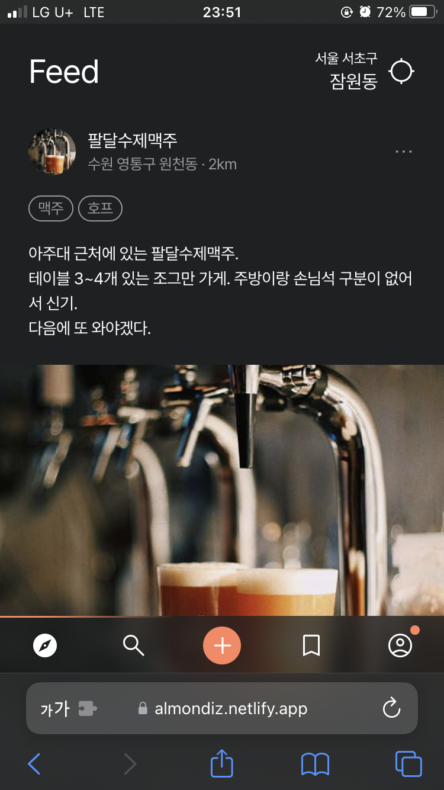
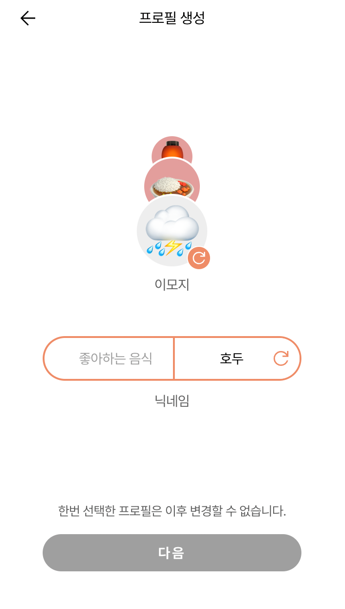
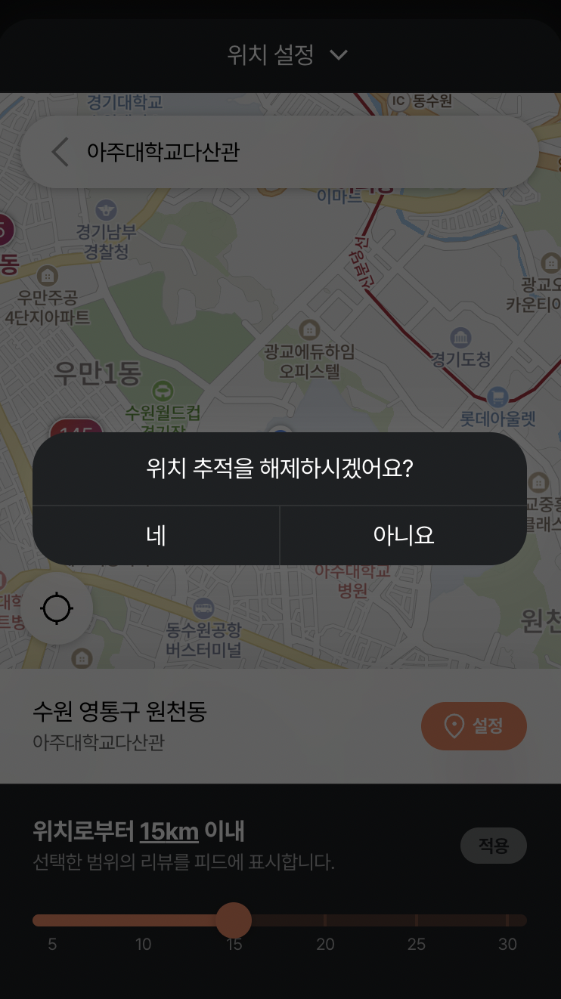

# almondiz-client

Almondiz: a restaurant-recommendation social app built around honest reviews — ended before reaching a real release.

**[Figma](https://www.figma.com/design/iAKW1aPykrL3NnGrw12jCt/almondiz---220808)**

## Screenshots

  

## What this is

Ratings are known to sway restaurant choices heavily, but fake reviews and rating manipulation are just as common — Almondiz's premise was a review feed built around identity you can trust, without turning it into a popularity contest:

- Reviews are anonymous (no DMs) — identity is a randomly assigned emoji plus a favorite-food nickname, not a name — but the feed is built around your location, with an adjustable radius, so you see what people nearby are actually saying.
- Instead of chasing a single aggregate score, you subscribe to reviewers whose taste matches yours.
- Reviewers with enough subscribers could earn ad revenue, similar to a creator-monetization model.

## Notes

- Each project moved to a newer frontend stack: [kpx-ui](https://github.com/canplane/kpx-ui) (jQuery/Bootstrap) → [udigo-ui](https://github.com/canplane/udigo-ui) (vanilla JS/CSS) → this, the first one built with a modern framework.
- Organized as an MVVM-ish structure: `models` (including `apis`) and `view-models` sit apart from `components` (a reusable library — modal, image slider/grid/viewer, toast, comment list...) and per-feature `views` (feed, post, search, notice...), with Redux Toolkit (`store/slices`) for shared state.
- Ended before a real release: pulling structured restaurant detail (menu, pricing) turned out to need more scraping infrastructure than expected, and around the same time the team scattered to jobs, grad school, and other things.

## About

- **Team:** 2 frontend, 2 backend, 1 designer
- **My role:** frontend implementation (React/SCSS), plus UI/UX design assistance
- **Timeline:** 2022-07-08 – 2023-01-24
- **Environment:** React, Redux Toolkit, SCSS
- **Organization:** [almondiz](https://github.com/almondiz)

See [README.original.md](README.original.md) for the original team install/run manual.

---
[github.com/canplane/almondiz-client](https://github.com/canplane/almondiz-client)
